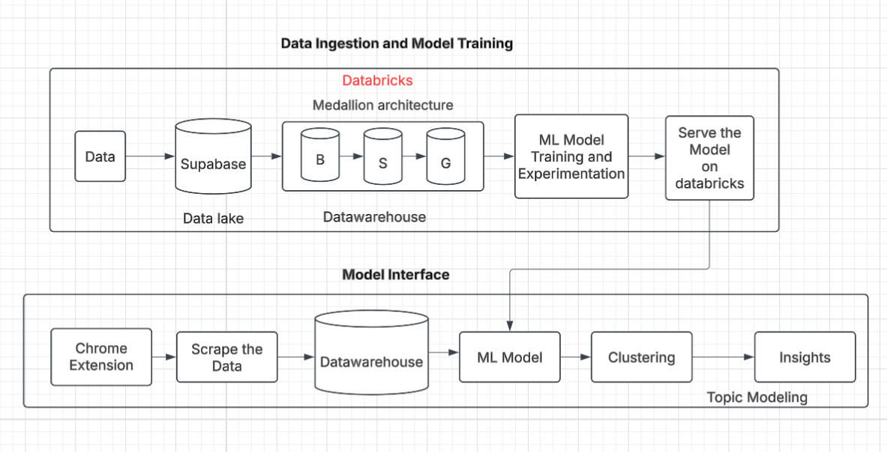
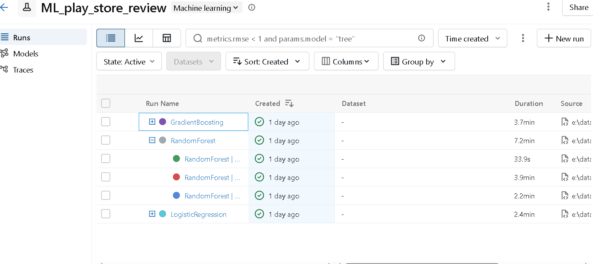
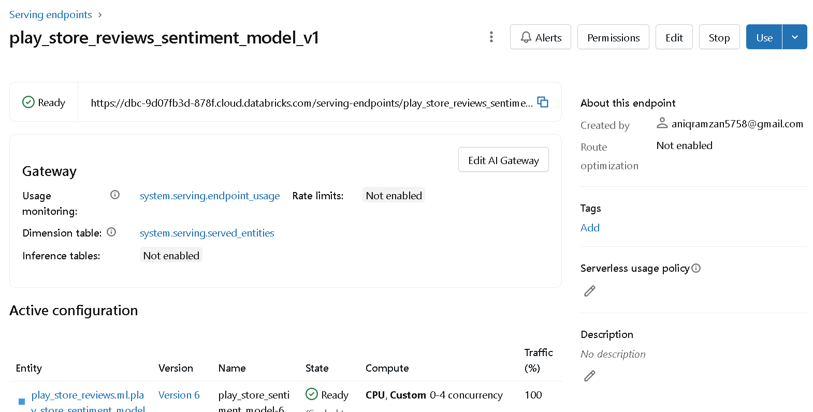

# Google Play Store Review Analysis & Insights System

[](https://www.python.org/)
[](https://fastapi.tiangolo.com/)
[](https://www.databricks.com/)
[](https://opensource.org/licenses/MIT)

An end-to-end Machine Learning ecosystem designed to scrape, analyze, and visualize Google Play Store reviews. This project leverages a Medallion data architecture, Databricks for scalable ML training and serving, and a Chrome extension for real-time consumer insights.

## 🚀 Overview

Understanding user sentiment and extracting actionable topics from thousands of app reviews is a massive challenge for product managers and developers. This system solves that by:
- **Automating Data Ingestion**: Scraping reviews directly via a Chrome Extension or SerpApi.
- **Architecting Scalable Data**: Using the Medallion (Bronze → Silver → Gold) pattern on Databricks/Supabase.
- **Serving Intelligence**: Providing real-time sentiment analysis and batch topic clustering.
- **Visualizing Value**: Delivering a dashboard directly in the browser to visualize trends and "pain points."

---

## 🏗️ Architecture

The system follows a modern MLOps architecture integrated with cloud data lakes and real-time API serving.



### Component Breakdown
1.  **Chrome Extension**: The entry point for users to scrape reviews and view the integrated Insights Dashboard.
2.  **FastAPI Backend**: Acts as the orchestrator, communicating with the scrapers, the Databricks serving endpoint, and the visualization engine.
3.  **Supabase Data Lake**: Stores raw and processed review data.
4.  **Medallion Pipeline**:
    - **Bronze**: Raw review ingestion.
    - **Silver**: Cleaned, tokenized, and deduplicated data.
    - **Gold**: Aggregated insights and feature-engineered datasets for training.
5.  **Databricks ML**:
    - **Training**: Fine-tuning transformer models for sentiment analysis.
    - **Serving**: Real-time inference via REST endpoints for instant sentiment prediction.
6.  **Insights Engine**: Uses clustering (HDBSCAN/UMAP) and NLP (KeyBERT) to group reviews into meaningful product topics.

---

## ✨ Key Features

- **Real-time Sentiment Analysis**: Instant classification of reviews into Positive, Neutral, or Negative using Databricks Serving.
- **Automated Topic Clustering**: Discovery of hidden themes in reviews (e.g., "UI Bugs", "Battery Drain", "Feature Requests") using Sentence Transformers and HDBSCAN.
- **Medallion Data Architecture**: Robust data engineering flow ensuring data quality from raw logs to analytics-ready tables.
- **Chrome Extension Dashboard**: A premium UI built with Chart.js to show sentiment distribution and top negative/positive topics directly on the Play Store page.
- **Scalable ML Pipelines**: Integration with MLflow for model versioning and tracking.

---

## CI/CD Pipeline

This project uses **GitHub Actions** for Continuous Integration (CI).

### What is CI/CD?

**CI/CD** (Continuous Integration and Continuous Delivery/Deployment) is a set of practices that automate the process of developing, testing, and deploying software. 

- **CI (Continuous Integration)**: Automates the process of merging code changes and running tests/linting on every push to the repository. This helps catch bugs early.
- **CD (Continuous Delivery/Deployment)**: Automates the process of preparing or deploying the software to a target environment once the CI pipeline passes.

### How it Works in This Project

The CI pipeline is defined in `.github/workflows/ci.yml`. It runs automatically on every `push` or `pull_request` to the `main` branch.

**The pipeline performs the following steps:**
1. **Installs** all dependencies from `requirements.txt`.
2. **Lints** the code using `flake8` to ensure syntax correctness and style consistency.
3. **Tests** the code by ensuring it can be compiled without errors.

---

## 📸 Demo & Screenshots

### Insights Dashboard
.png)

### Databricks Experimentation


### Model Serving


---

## 📁 Repository Structure

```text
├── backend/            # FastAPI server and API endpoints
├── extension/          # Chrome Extension source code (HTML/JS/Manifest)
├── src/
│   ├── data_pipeline/  # Medallion architecture (Bronze/Silver/Gold)
│   ├── training/       # Databricks training notebooks and scripts
│   ├── serving/        # Client for Databricks Serving endpoints
│   ├── clustering/     # HDBSCAN and UMAP topic extraction logic
│   ├── insights/       # Visualization and summary generation
│   ├── utils/          # Scrapers and shared utilities
├── Images/             # Screenshots and architecture diagrams
├── requirements.txt    # Project dependencies
└── databricks.yml      # Databricks Asset Bundle configuration
```

---

## 🛠️ Tech Stack

- **Backend**: Python, FastAPI, Uvicorn
- **ML/AI**: Databricks, MLflow, PyTorch, Transformers (BERT/RoBERTa), Sentence-Transformers
- **Clustering**: HDBSCAN, UMAP, KeyBERT
- **Data Engineering**: Supabase (PostgreSQL), Pandas, SQLAlchemy, Databricks Connect
- **Frontend/Extension**: JavaScript (ES6+), Chart.js, Chrome Extension APIs
- **LLM Integration**: LangChain, Groq (for advanced insight summaries)

---

## ⚙️ Installation & Setup

### 1. Project Initialization
```bash
git clone https://github.com/your-repo/play-store-analysis.git
cd play-store-analysis
python -m venv .venv
source .venv/bin/activate  # Or .venv\Scripts\activate on Windows
pip install -r requirements.txt
```

### 2. Environment Configuration
Create a `.env` file in the root:
```env
SUPABASE_URL=your_url
SUPABASE_KEY=your_key
DATABRICKS_HOST=your_host
DATABRICKS_TOKEN=your_token
SERPAPI_KEY=your_key
```

### 3. Running the Backend
```bash
uvicorn backend.api:app --reload
```

### 4. Chrome Extension
1. Open Chrome and navigate to `chrome://extensions/`.
2. Enable **Developer mode**.
3. Click **Load unpacked** and select the `extension/` folder.

---

## 🔄 ML Pipeline Flow

### Ingest & Process
The `src/datawarehouse` module manages the flow:
- **Bronze**: Reviews are fetched via `SerpApiScraper` and stored raw.
- **Silver**: `src/ml` handles cleaning and initial feature extraction.
- **Gold**: Data is structured for topic modeling and sentiment training.

### Inference
- **Real-time**: The `analyze` endpoint in the backend calls the Databricks Serving endpoint for immediate sentiment.
- **Batch**: Periodic jobs run the `ReviewClusterer` to update the global insights for an app.

---

## 🗺️ Roadmap: Automated Model Retraining

The next phase of this project includes an automated retraining loop:
1. **Feedback Collection**: Capturing user-corrected sentiments from the extension.
2. **Gold Dataset Refresh**: Daily updates to the training set with newly labeled data.
3. **Triggered Retraining**: Databricks Workflows to trigger MLflow runs when data drift is detected.
4. **Auto-Deployment**: Registering the new champion model and updating the serving endpoint with zero downtime.

---

## 🤝 Contributing

Contributions are what make the open-source community an amazing place to learn, inspire, and create.
1. Fork the Project
2. Create your Feature Branch (`git checkout -b feature/AmazingFeature`)
3. Commit your Changes (`git commit -m 'Add some AmazingFeature'`)
4. Push to the Branch (`git push origin feature/AmazingFeature`)
5. Open a Pull Request

---

## 📄 License

Distributed under the MIT License. See `LICENSE` for more information.
